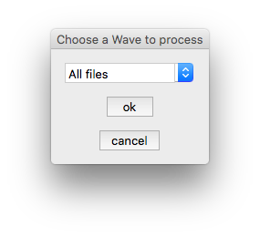

#Configuration-Driven Exports

##Icon export script for Adobe Photoshop

###Table of Contents
- [Usage](#usage)
- [Minimal example](#minimal-configuration-object-syntax)
- [Simple usage](#simple-example-execution-script)
- [Full configuration spec](#full-object-configuration-options)
- [Credits](#credits)



###Usage
From Photoshop, select the script from `File->Scripts->Browse...`, browse to createIcons.jsx, and select OK. Output files based on the configuration will be saved to the folder of the image (TODO: image selection).

###Minimal Configuration Object Syntax
This configuration will save a 76x76 image called `Icon-76.png` in a folder `./iOS/square` relative to the source psd.
```javascript
{
  "sizes":[
    {
      "x":76,
      "y":76,
      "name":"Icon-76.png",
      "subFolder":"square"
    }
    //...
  ],
  "outputFolder":"iOS" //create and/or target a folder relative to where the .psd is located
}
```

###Simple example execution script
If you don't provide the script with an explicit location as the first parameter, a `File Open` dialog will spawn to ask you to select a file.
```javascript
//include the library
#include "lib/CreateAlliPhoneIcons.jsx"

//create the configuration object
var config = {
  "sizes":[
    {"x":76,"y":76,"name":"Icon-76.png","subFolder":"@1x"},
    {"x":152,"y":152,"name":"Icon-76@2x.png","subFolder":"@2x"},
  ],
  "confirm":false,
  "outputFolder":"iOS"
};

//run the script using the given configuration
doResizeAndOutput(config);
```

###Example execution script with hard-coded file
Providing an initial, optional file parameter suppresses the `File Open` dialog, which is useful for batch-processing numerous files.
```javascript
//include the library
#include "lib/CreateAlliPhoneIcons.jsx"

//create the configuration object
var config = {
  "sizes":[
    {"x":76,"y":76,"name":"Icon-76.png","subFolder":"@1x"},
    {"x":152,"y":152,"name":"Icon-76@2x.png","subFolder":"@2x"},
  ],
  "confirm":false,
  "outputFolder":"iOS"
};

var file = "~/path/to/file";

//run the script using the given configuration
doResizeAndOutput(file, config);
```

###Sample Configuration Object for common iOS sizes
Suppressing confirmation dialog, as well as creating a base output folder only.
```javascript
{
  "sizes":[
    {"x":76,"y":76,"name":"Icon-76.png"},
    {"x":152,"y":152,"name":"Icon-76@2x.png"},
    {"x":167,"y":167,"name":"Icon-83.5@2x.png"},
    {"x":120,"y":120,"name":"Icon-60@2x.png"},
    {"x":180,"y":180,"name":"Icon-60@3x.png"},
    {"x":40,"y":40,"name":"Icon-40.png"},
    {"x":80,"y":80,"name":"Icon-40@2x.png"},
    {"x":120,"y":120,"name":"Icon-40@3x.png"},
    {"x":29,"y":29,"name":"Icon-29.png"},
    {"x":58,"y":58,"name":"Icon-29@2x.png"},
    {"x":87,"y":87,"name":"Icon-29@3x.png"}
  ],
  "confirm":false, //suppress confirmation dialog
  "outputFolder":"iOS", //create and/or target a folder relative to where the .psd is located
  "traverseLayers":true //traverse the layer folder sets of a document, and output a set of files per layer set
}
```

###Full object configuration options
* `sizes` **array**: an array of size objects, which define each configuration of image output.
* `confirm` **boolean**: if set to **true**, an alert dialog is presented in Photoshop at the end of the script execution.
* `outputFolder` **string**: name of the default folder to output all images. The final location of any file is a combination of `outputFolder`, `subFolder` and possibly the layerset name (if `traverseLayers` is enabled).
* `traverseLayers` **boolean** _(optional)_: If `traverseLayers` is set to `true`, rather than outputting a single set of files for a given image, the script looks for layer sets (folders) within the document, specifically with a dash in the name, for example `cincinnati-oh`, and runs the output script for each layer that matches. This path is combined with `outputFolder` and `subFolder`, as in **layer-name**/`outputFolder`/`subFolder`/**filename.png**. As a side-effect of this option, all layerset folders in the photoshop document that do not have a hypen in the name are ignored.


The `sizes` array takes a few required and _optional_ properties in each of its array's objects.
* `x` **integer**: width of the resized image.
* `y` **integer**: height of the resized image.
* `name` **string**: file name. This script only outputs pngs, so **.png** should be added to the file name as per the examples.
* `subFolder` **string** _(optional)_: combines with `outputFolder` to create a per-item output path. For example, if `outputFolder` is **iOS** and `subFolder` is **@2x**, the final path of an image would be **iOS/@2x**.
* `canvasSize` **object** _(optional)_: increases the canvas size of an image before saving, but after resizing. A sample use-case is that iOS requires icons to be the full width available for an app, whereas Android requests 8px of padding around each icon. Designers can use the same icon for both, and only on output is the padding added to the Android assets.


```javascript
{
  "sizes":[
    {
      "x":72,
      "y":72,
      "name":"Icon-76.png",
      "subFolder":"name/of/subfolder", //combined with outputFolder
      "canvasSize":{ //increases the size of the image post-resize
        "x":80,
        "y":80
      }
    }
  ],
  "confirm":false, //suppress confirmation dialog
  "outputFolder":"iOS", //create and/or target a folder relative to where the .psd is located
  "traverseLayers":true //traverse the layer folder sets of a document, and output a set of files per layer set
}
```

###Credits
Based on the work by [John Ballinger](https://twitter.com/sponno), who released the [original script](https://github.com/sponno/iPhone-Photoshop-JSX-Icon-Exporter) under the [Creative Commons Attribution 3.0 New Zealand License](http://creativecommons.org/licenses/by/3.0/nz/)
