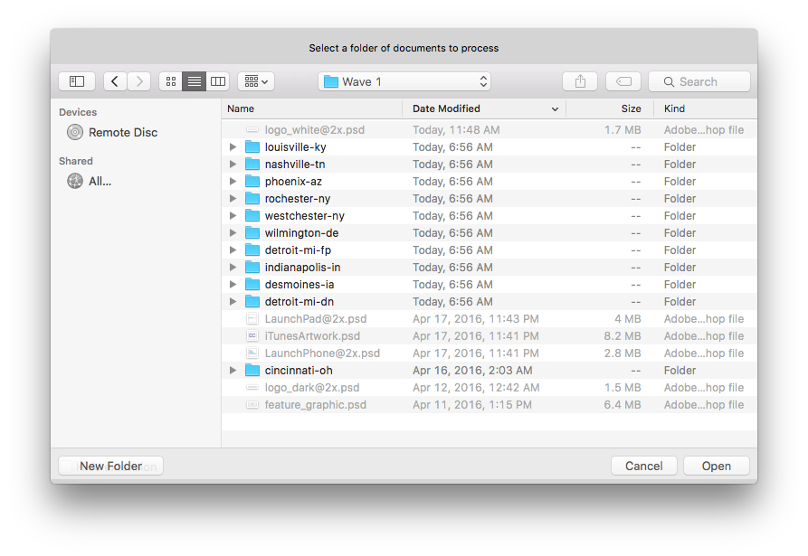
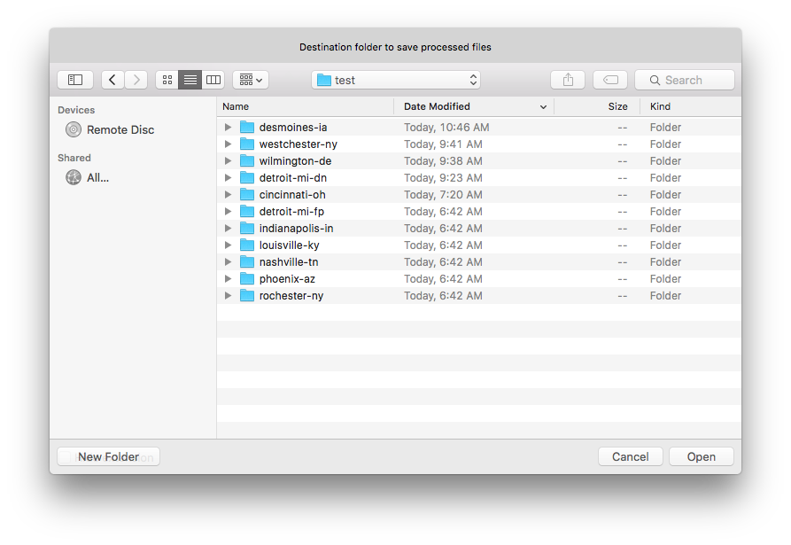
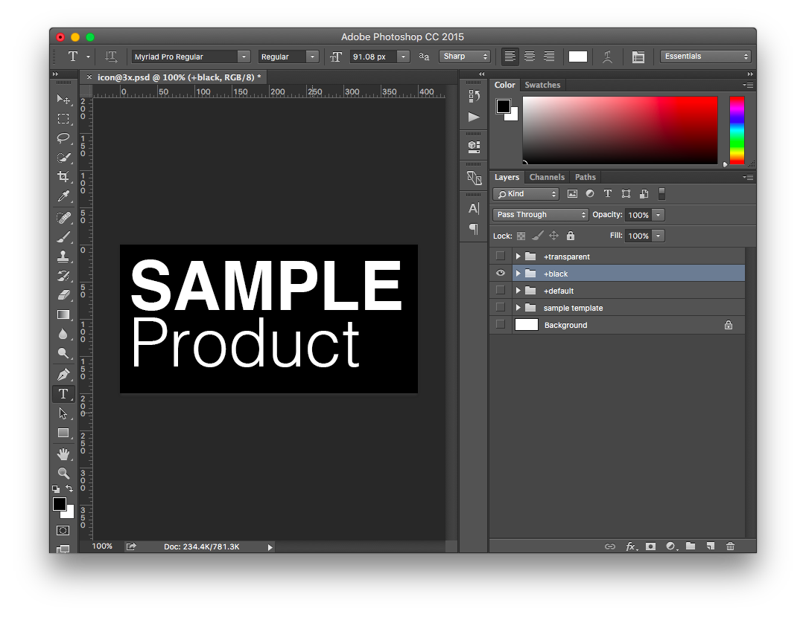

#Photoshop Exporter jsx

##Highly configurable export scripting utility for Adobe Photoshop

While this script was primarily authored for use in helping to generate icons and assets for native application usage, the general concepts and utilities are applicable to any scenario where mutliple sizes of the same asset are required.

##Core features
* JSON-based configuration for asset definition
* Export hundreds of sizes of the same file using a single script
* Individual exports can be placed in a number of different sub-folder configurations
* Smart cropping of individual exports can crop white-space from an image before export
* Post-crop/pre-export canvas resizing for alpha padding
* Optimized png-24 output
* Solves for numerous Photoshop bugs with hilarious workarounds


###Table of Contents for Designers
- [Introduction](#introduction)
- [Usage](#usage)

###Technical Table of Contents
- [Minimal example](#minimal-configuration-object-syntax)
- [Simple usage](#simple-example-execution-script)
- [Full configuration spec](#full-object-configuration-options)
- [Credits](#credits)

###Introduction
There are a number of ways to launch the script. The most straight forward, while not the fastest, is from Photoshop: select the script from `File->Scripts->Browse...`, browse to smart-selection.jsx, and select OK. Alternatively, the smart-selection.jsx script can be dragged onto the Photoshop icon in OS X's dock, which is faster but slightly more cumbersome.

Once the script is launched, there are 3 steps: Select which folder to process files from, select where to put the output, and choose a file (or files) to process.

###Usage
1. Select an input folder. This should be where the .psd documents are located that should be processed. *Note*: you do not select a specific file at this step.

2. Select an output folder. This is the base folder where files should be output to.

3. Choose a file to process, or select "All files." Only valid file names can be selected.


Once you select the appropriate file(s) to process, the script runs for an indefinite amount of time. While the script runs, Photoshop cannot be used. Do not be alarmed by distorted or mis-aligned images showing up in Photoshop while it runs, as the script operates faster than the program can re-draw the document art contents in the window.

The script outputs files based on rules in the configuration for each file, contained in the smart-selection.jsx file. New configurations can be added there, as per the technical documentation below.

-------------

##Technical Introduction
There are three core files that are used to create the image processing experience: smart-selection.jsx, smartProcess.jsx and CreateAlliPhoneIcons.jsx.
* **smart-selection.jsx**: The configuration interface into the library. Under normal use-cases, any changes to how the library is used should be done in this script. It lists valid files that can be processed, lists a series of configurations for both iOS and Android for each valid file type, and triggers the UI selection process and subsequent file processing steps.
* **smartProcess.jsx**: This file takes a source file, prepares it for processing, and eventually triggers the processing.
* **CreateAlliPhoneIcons.jsx**: This file contains the image output settings, and actually does the image processing.

###Simple example
For the following example, assume there is a PSD that has an aspect ratio of 2:1. The layer structure guidelines need to be observed as per the example file, illustrated in this screenshot:


```javascript
//documentation/examples/simple.jsx

#include "../../lib/smartProcess.jsx";

smartProcess({
  "inputFile":"~/photoshop-exporter-jsx/documentation/examples/icon@3x.psd",
  "outputBaseFolder":"~/projects/fancyApp/build/",
	"confirm":false,
  "outputFolder": "iOS",
  "traverseLayers":true,
  "sizes":[
		{"x":100,"y":50,"name":"sample.png"},
		{"x":200,"y":100,"name":"sample@2x.png"},
		{"x":400,"y":200,"name":"sample@3x.png"}
  ]
});
```

The output of this script would be the following folder/file structure:
```
~/projects
  |--fancyApp
    |--build
      |--black
        |--iOS
          |--sample.png     //100x50px
          |--sample@2x.png  //200x100px
          |--sample@3x.png  //400x100px
      |--default
        |--iOS
          |--sample.png     //100x50px
          |--sample@2x.png  //200x100px
          |--sample@3x.png  //400x100px
      |--transparent
        |--iOS
          |--sample.png     //100x50px
          |--sample@2x.png  //200x100px
          |--sample@3x.png  //400x100px          
```
Any folders in the hierarchy will be created automatically if they don't already exist.


###Minimal Configuration Object Syntax
This configuration will save a 76x76 image called `Icon-76.png` in a folder `./iOS/square` relative to the source psd.
```javascript
{
  "sizes":[
    {
      "x":76,
      "y":76,
      "name":"Icon-76.png",
      "subFolder":"square"
    }
    //...
  ],
  "outputFolder":"iOS" //create and/or target a folder relative to where the .psd is located
}
```

###Simple example execution script
If you don't provide the script with an explicit location as the first parameter, a `File Open` dialog will spawn to ask you to select a file.
```javascript
//include the library
#include "lib/CreateAlliPhoneIcons.jsx"

//create the configuration object
var config = {
  "sizes":[
    {"x":76,"y":76,"name":"Icon-76.png","subFolder":"@1x"},
    {"x":152,"y":152,"name":"Icon-76@2x.png","subFolder":"@2x"},
  ],
  "confirm":false,
  "outputFolder":"iOS"
};

//run the script using the given configuration
doResizeAndOutput(config);
```

###Example execution script with hard-coded file
Providing an initial, optional file parameter suppresses the `File Open` dialog, which is useful for batch-processing numerous files.
```javascript
//include the library
#include "lib/CreateAlliPhoneIcons.jsx"

//create the configuration object
var config = {
  "sizes":[
    {"x":76,"y":76,"name":"Icon-76.png","subFolder":"@1x"},
    {"x":152,"y":152,"name":"Icon-76@2x.png","subFolder":"@2x"},
  ],
  "confirm":false,
  "outputFolder":"iOS"
};

var file = "~/path/to/file";

//run the script using the given configuration
doResizeAndOutput(file, config);
```

###Sample Configuration Object for common iOS sizes
Suppressing confirmation dialog, as well as creating a base output folder only.
```javascript
{
  "sizes":[
    {"x":76,"y":76,"name":"Icon-76.png"},
    {"x":152,"y":152,"name":"Icon-76@2x.png"},
    {"x":167,"y":167,"name":"Icon-83.5@2x.png"},
    {"x":120,"y":120,"name":"Icon-60@2x.png"},
    {"x":180,"y":180,"name":"Icon-60@3x.png"},
    {"x":40,"y":40,"name":"Icon-40.png"},
    {"x":80,"y":80,"name":"Icon-40@2x.png"},
    {"x":120,"y":120,"name":"Icon-40@3x.png"},
    {"x":29,"y":29,"name":"Icon-29.png"},
    {"x":58,"y":58,"name":"Icon-29@2x.png"},
    {"x":87,"y":87,"name":"Icon-29@3x.png"}
  ],
  "confirm":false, //suppress confirmation dialog
  "outputFolder":"iOS", //create and/or target a folder relative to where the .psd is located
  "traverseLayers":true //traverse the layer folder sets of a document, and output a set of files per layer set
}
```

###Full object configuration options
* `sizes` **array**: an array of size objects, which define each configuration of image output.
* `confirm` **boolean**: if set to **true**, an alert dialog is presented in Photoshop at the end of the script execution.
* `outputFolder` **string**: name of the default folder to output all images. The final location of any file is a combination of `outputFolder`, `subFolder` and possibly the layerset name (if `traverseLayers` is enabled).
* `traverseLayers` **boolean** _(optional)_: If `traverseLayers` is set to `true`, rather than outputting a single set of files for a given image, the script looks for layer sets (folders) within the document, specifically with a dash in the name, for example `cincinnati-oh`, and runs the output script for each layer that matches. This path is combined with `outputFolder` and `subFolder`, as in **layer-name**/`outputFolder`/`subFolder`/**filename.png**. As a side-effect of this option, all layerset folders in the photoshop document that do not have a hypen in the name are ignored.


The `sizes` array takes a few required and _optional_ properties in each of its array's objects.
* `x` **integer**: width of the resized image.
* `y` **integer**: height of the resized image.
* `name` **string**: file name. This script only outputs pngs, so **.png** should be added to the file name as per the examples.
* `subFolder` **string** _(optional)_: combines with `outputFolder` to create a per-item output path. For example, if `outputFolder` is **iOS** and `subFolder` is **@2x**, the final path of an image would be **iOS/@2x**.
* `canvasSize` **object** _(optional)_: increases the canvas size of an image before saving, but after resizing. A sample use-case is that iOS requires icons to be the full width available for an app, whereas Android requests 8px of padding around each icon. Designers can use the same icon for both, and only on output is the padding added to the Android assets.


```javascript
{
  "sizes":[
    {
      "x":72,
      "y":72,
      "name":"Icon-76.png",
      "subFolder":"name/of/subfolder", //combined with outputFolder
      "canvasSize":{ //increases the size of the image post-resize
        "x":80,
        "y":80
      }
    }
  ],
  "confirm":false, //suppress confirmation dialog
  "outputFolder":"iOS", //create and/or target a folder relative to where the .psd is located
  "traverseLayers":true //traverse the layer folder sets of a document, and output a set of files per layer set
}
```

##TODO
- [ ] Update Readme to reflect api changes

###Credits
Based on the work by [John Ballinger](https://twitter.com/sponno), who released the [original script](https://github.com/sponno/iPhone-Photoshop-JSX-Icon-Exporter) under the [Creative Commons Attribution 3.0 New Zealand License](http://creativecommons.org/licenses/by/3.0/nz/)
